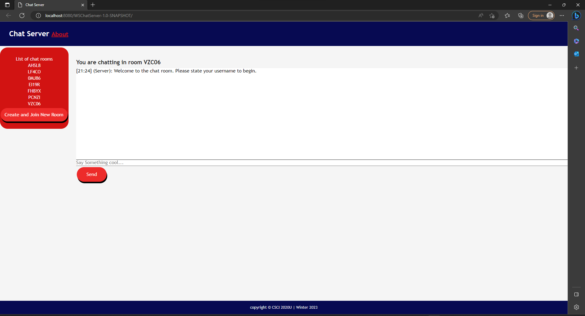
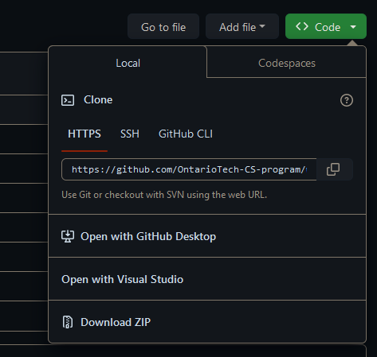
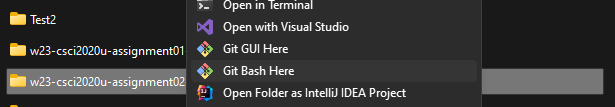
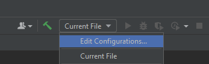
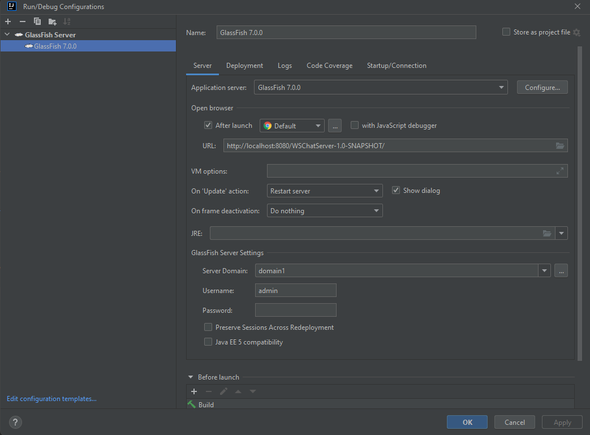
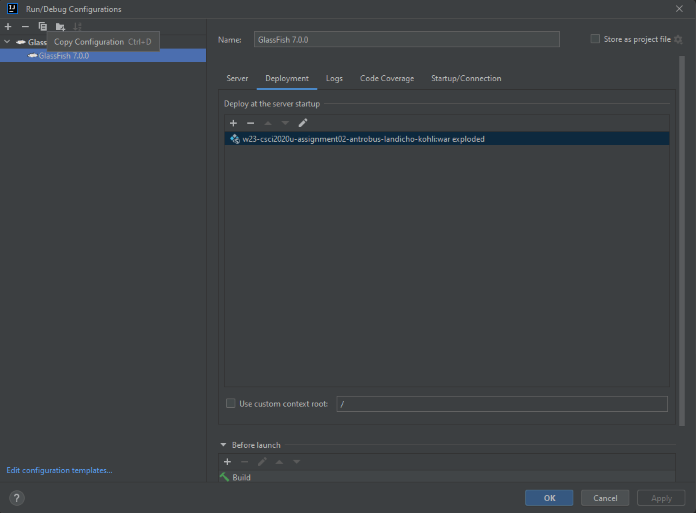
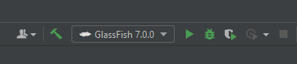
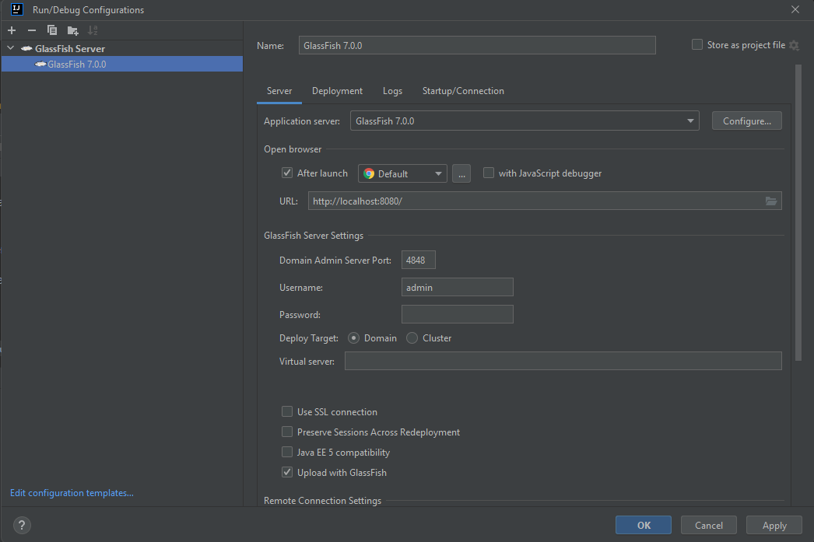
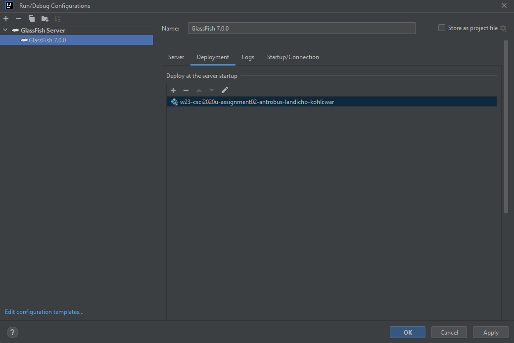

[//]: # (# Assignment 02 - Web Chat Server &#40;Instructions&#41;)

[//]: # (> Course: CSCI 2020U: Software Systems Development and Integration)

[//]: # ()
[//]: # (This is the template for your Assignment 02.)

[//]: # ()
[//]: # (## Overview)

[//]: # (You want to create a web chat server with multiple rooms. This will allow you and your friends to chat privately.)

[//]: # ()
[//]: # (- Check the `Canvas/Assingments/Assignment 02` for more the detailed instructions.)

[//]: # ()
[//]: # (### WebChatServer - Endpoints)

[//]: # ()
[//]: # (**Connect to the websocket**)

[//]: # ()
[//]: # (From the `ChatServer` class. This will create a new client connect to the web server. The server and client communicate using `json` messages.)

[//]: # (- `ws://localhost:8080/WSChatServer-1.0-SNAPSHOT/ws/{roomID}`)

[//]: # ()
[//]: # ()
[//]: # (**GET a new &#40;unique&#41; room code**)

[//]: # ()
[//]: # (From the `ChatServlet` class. This will return a `text/plain` content type.)

[//]: # (- `http://localhost:8080/WSChatServer-1.0-SNAPSHOT/chat-servlet`)

[//]: # (See a sample of the response data:)

[//]: # (```)

[//]: # (1B9FN)

[//]: # (```)

[//]: # ()
[//]: # (### WebChatServer - client)

[//]: # ()
[//]: # (Your client is in the `webapp` folder, when started the application will run at `http://localhost:8080/WSChatServer-1.0-SNAPSHOT/`; which will load the `index.html` file.)

[//]: # ()
[//]: # (Your client-side code will be in the `js/main.js` javascript file.)

[//]: # ()
[//]: # (> Obs. Feel free to create other helper classes as you see fit.)

[//]: # (>)

[//]: # ()
[//]: # ()
[//]: # ()
[//]: # ()
[//]: # ()
[//]: # ()


# Assignment 02 - Web Chat Server (Instructions)
<!-- > Course: CSCI 2020U: Software Systems Development and Integration -->

<!-- This is the template for your Assignment 02. -->
## Table Of Contents
- [Project Information](#Project-Information)
    - [Description](#Description)
    - [Screenshots](#Screenshots)
    - [Screenshot 1](#Screenshot-1)
    - [Screenshot 2](#Screenshot-2)
- [Improvements](#Improvements)
    - [Chat History](#Chat-History)
- [How To Run](#How-To-Run)

[//]: # (- [Other Resources]&#40;#Other-Resources&#41;)


## Project Information
### Description 
This project allows users to create and join a randomly generated room or 
join an existing room through the list of room codes. This project uses Html, Css, Javasript 
and a java restful api to host the server for our chatrooms.
## Screenshots
### Screenshot 1
A picture showing the list of chatrooms.


[//]: # ()

### Screenshot 2
A picture showing message sending in the chatroom.


## Improvements
### Chat History
We have attempted to add a chatroom history. In theory, this feature logs all the messages (including usernames and times)
, then saves a file containing all the logged messages.

## How To Run
These are the instructions to run the code

NOTE: You must already have glassfish installed. 
For instructions on how to install glassfish, head to this website: https://docs.oracle.com/cd/E26576_01/doc.312/e24935/installing.htm#GSING00002

1. Go to our ``github`` repository:
https://github.com/OntarioTech-CS-program/w23-csci2020u-assignment02-antrobus-landicho-kohli
and ``copy`` the project from the ``code`` dropdown, cloning it into the local directory of your choice

#
2. Load the project folder through ``Intellij`` by left-clicking the project and selecting ``Open Folder as Intellij IDEA Project``\

#
3. Go to the ``current file`` dropdown (at the top of the window) and select ``edit configurations``.\

#
4. Add a ``glassfish local server``, selecting ``domain 1`` as the server domain.\

#
5. Then head over to the ``deployment tab`` and add (+ button) an artifact for ``war exploded``. Then Select Ok.\

#
6. Select the ``run`` button (beside the glassfish menu). Then, a browser with the chatroom should appear.\


Select the ``create and join a new room`` button to generate a new random room, or, join an ``existing room`` from the list of room codes.

You must then enter your ``username`` for the chatroom and then you may ``begin chatting``.

You may ``add more users`` through copying the url into another tab/browser.
#
7. For chat history, ``repeat step 2`` for the folder ``ChatHistoryAPI``, which is a directory within the project opened in step 2. You should now have ``2 Intellij projects`` open.
#
8. In the ``ChatHistoryAPI``, repeat step 3 and instead add a glassfish ``remote`` server

#
9. Repeat step 6 and instead add an artifact for ``war``. Then select ok.



[//]: # (List Should Ressemble:)

[//]: # (```)

[//]: # ([{"spamProbRounded":"0.00000","file":"00006.654c4ec7c059531accf388a807064363","spamProbability":5.901245803391957E-62,"actualClass":"Ham"},{"spamProbRounded":"0.00000","file":"00007.2e086b13730b68a21ee715db145522b9","spamProbability":2.800348071907053E-12,"actualClass":"Ham"},{"spamProbRounded":"0.00000","file":"00008.6b73027e1e56131377941ff1db17ff12","spamProbability":8.66861037294167E-14,"actualClass":"Ham"},{"spamProbRounded":"0.00000","file":"00009.13c349859b09264fa131872ed4fb6e4e","spamProbability":6.947265471550557E-12,"actualClass":"Ham"},{"spamProbRounded":"0.00000","file":"00010.d1b4dbbad797c5c0537c5a0670c373fd","spamProbability":1.8814467288977145E-7,"actualClass":"Ham"},{"spamProbRounded":"0.00039","file":"00011.bc1aa4dca14300a8eec8b7658e568f29","spamProbability":3.892844289937937E-4,"actualClass":"Ham"}])

[//]: # (```)

[//]: # ()
[//]: # (## Evalutation)

[//]: # (1. Make a request for the probability data in the js file)

[//]: # (2. Return a response object with the data in the resource file)

[//]: # (3. Use data from response to populate the table)

[//]: # ()
[//]: # (## Running The Code)

[//]: # (1. Run glassfish server through the resource file with the default endpoint http://localhost:8080/spamDetector-1.0/api/spam)

[//]: # (2. Run the current file in for the html)

[//]: # (3. View final website with table of probabilities and accuracy)

[//]: # ()
[//]: # (<!-- )

[//]: # (You have become frustrated with all the advertisements in your inbox. You resolve to create a spam detector to filter out the spam. The spam detector will use a dataset of E-Mails &#40;spam or otherwise&#41; to train your program to recognize whether or not new E-Mails are spam. The program will use a unigram approach [1], where each word is counted and associated with whether or not the message is spam. Your program will calculate probabilities based on each word’s frequency [2]. Luckily, you have not emptied your spam folder or inbox in quite a while, so you have many samples to use to train your system. )

[//]: # ()
[//]: # (- Check the `Canvas/Assingments/Assignment 01` for more the detailed instructions.)

[//]: # ()
[//]: # (### SpamDetectorServer - Endpoints)

[//]: # ()
[//]: # (**Listing all the test files**)

[//]: # ()
[//]: # (This will return a `application/json` content type.)

[//]: # (- `http://localhost:8080/spamDetector-1.0/api/spam`)

[//]: # (See a sample of the response data:)

[//]: # ()
[//]: # ()
[//]: # (**Calculate and get accuracy**)

[//]: # (This will return a `application/json` content type.)

[//]: # (- `http://localhost:8080/spamDetector-1.0/api/spam/accuracy`)

[//]: # (See a sample of the response data:)

[//]: # (```)

[//]: # ({"val": 0.87564})

[//]: # (```)

[//]: # ()
[//]: # (**Calculate and get precision**)

[//]: # (This will return a `application/json` content type.)

[//]: # (- `http://localhost:8080/spamDetector-1.0/api/spam/precision`)

[//]: # (See a sample of the response data:)

[//]: # (```)

[//]: # ({"val": 0.56484})

[//]: # (```)

[//]: # (### SpamDetectorServer - SpamDetector class)

[//]: # ()
[//]: # (Most of your programming will be in the `SpamDetector` class. This class will be responsible for reading the testing and training data files, training, and tesing the model.)

[//]: # ()
[//]: # (> Obs1. Feel free to create other helper classes as you see fit.)

[//]: # (> )

[//]: # (> Obs2. You are not expected to get the exact same values as the ones shown in the samples.)

[//]: # ()
[//]: # (### References )

[//]: # ([1] https://en.wikipedia.org/wiki/Bag-of-words_model )

[//]: # ()
[//]: # ([2] https://en.wikipedia.org/wiki/Naive_Bayes_spam_filtering  -->)

